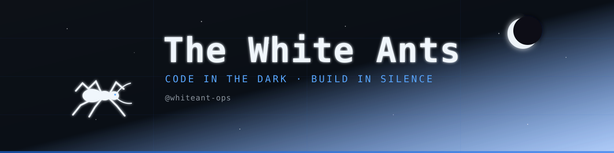

<!-- Banner -->
<p align="center">
  
</p>

<p align="center">
  
</p>


<p align="center">
  <a href="https://linkedin.com/in/whiteant-ops"></a>
  <a href="https://twitter.com/whiteant_ops"></a>
  <a href="mailto:polar-walk93@bravealias.com"></a>
  
</p>


### 🌙 About Me

```yaml
name:        The White Ants
username:    whiteant-ops
role:        Software Engineer · Web3 · Data & Security
location:    Indonesia
hobbies:     [anime, manga, late-night-coding, CTF]
philosophy:  "Small ants, big systems — quiet, but they build everything."
```


- 🔭 Currently building **Web3 tools on Solana** & **internal analytics platforms**
- 🌱 Deepening **Rust**, **Zero-Knowledge**, and **Network Security**
- 💬 Ask me about **Laravel, Go, Rust, Solana, React, Data Mining**
- 🎯 I write **clean, tested, and secure** code — no shortcuts
- 🍥 Fun fact: I debug better at **2 AM with anime on the second monitor**

---

### 🛠️ Tech Arsenal

**Languages**


**Frontend**


**Backend & Frameworks**
<a href="https://laravel.com">

</a>


**Web3**


**Data & Security**


**Infra & Tools**


---

### 📊 GitHub Stats — Dark Mode

<p align="center">
  
  
</p>

<p align="center">
  
</p>

---

### 🚀 Featured Projects

| Project | Description | Stack |
|---------|-------------|-------|
| [**solana-ops-kit**](https://github.com/whiteant-ops/solana-ops-kit) | Tooling for Solana devs — quick anchor scaffolds & scripts | `Rust` `Anchor` `TS` |
| [**laravel-admin-forge**](https://github.com/whiteant-ops/laravel-admin-forge) | Opinionated Laravel admin boilerplate with roles & audit log | `Laravel` `Tailwind` `Postgres` |
| [**net-probe**](https://github.com/whiteant-ops/net-probe) | Lightweight network recon & monitoring CLI | `Go` `eBPF` |
| [**datamine-lab**](https://github.com/whiteant-ops/datamine-lab) | Notebooks & pipelines for scraping + analysis | `Python` `Pandas` `Jupyter` |

---

### 🍥 Anime Corner *(dark mode approved)*

<p align="center">
  
  
  
  
</p>

> *"The world is not beautiful, therefore it is."* — Kino no Tabi

---

<p align="center">
  <i>Build quietly. Ship loudly. 🌙</i>

  
</p>

<p align="center">
🎧 What I'm Listening To
</p>

<a href="https://www.youtube.com/watch?v=5SRMuef8THI&list=PLOjcZPLUbDMuzt75fAd9rltov6f25ITu-">

<p align="center">
  
  </p>
</a>
<p align="center">
  <i>Auto-updated every 24h via GitHub Actions</i>
</p>
