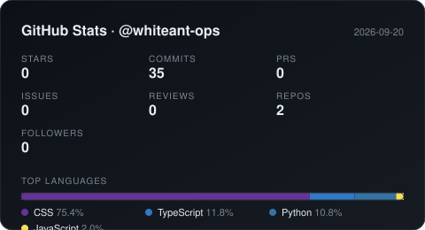

<!-- ═══════════════════════════════════════════════ -->
<!--                    BANNER                       -->
<!-- ═══════════════════════════════════════════════ -->

<p align="center">
  
</p>

<p align="center">
  
</p>

<p align="center">
  <a href="https://linkedin.com/in/whiteant-ops"></a>
  <a href="https://twitter.com/whiteant_ops"></a>
  <a href="mailto:polar-walk93@bravealias.com"></a>
  
</p>

---

<!-- ═══════════════════════════════════════════════ -->
<!--                  ABOUT ME                       -->
<!-- ═══════════════════════════════════════════════ -->

<h3 align="center">🌙 About Me</h3>

```yaml
name:        The White Ants
username:    whiteant-ops
role:        Software Engineer · Web3 · Data & Security
location:    Indonesia
hobbies:     [anime, manga, late-night-coding, CTF]
philosophy:  "Small ants, big systems — quiet, but they build everything."
```

- 🔭 Currently building **Web3 tools on Solana** & **internal analytics platforms**
- 🌱 Deepening **Rust**, **Zero-Knowledge**, and **Network Security**
- 💬 Ask me about **Laravel, Go, Rust, Solana, React, Data Mining**
- 🎯 I write **clean, tested, and secure** code — no shortcuts
- 🍥 Fun fact: I debug better at **2 AM with anime on the second monitor**

<!-- ═══════════════════════════════════════════════ -->
<!--                GITHUB STATS                     -->
<!-- ═══════════════════════════════════════════════ -->

---

<p align="center">
  
</p>

---

<!-- ═══════════════════════════════════════════════ -->
<!--              FEATURED PROJECTS                  -->
<!-- ═══════════════════════════════════════════════ -->

<h3 align="center">🚀 Featured Projects</h3>

| Project | Description | Stack |
|:--------|:------------|:------|
| [**solana-ops-kit**](https://github.com/whiteant-ops/solana-ops-kit) | Tooling for Solana devs — quick anchor scaffolds & scripts | `Rust` `Anchor` `TS` |
| [**laravel-admin-forge**](https://github.com/whiteant-ops/laravel-admin-forge) | Opinionated Laravel admin boilerplate with roles & audit log | `Laravel` `Tailwind` `Postgres` |
| [**net-probe**](https://github.com/whiteant-ops/net-probe) | Lightweight network recon & monitoring CLI | `Go` `eBPF` |
| [**datamine-lab**](https://github.com/whiteant-ops/datamine-lab) | Notebooks & pipelines for scraping + analysis | `Python` `Pandas` `Jupyter` |

---

<!-- ═══════════════════════════════════════════════ -->
<!--                ANIME CORNER                     -->
<!-- ═══════════════════════════════════════════════ -->

<h3 align="center">🍥 Anime Corner <em>(dark mode approved)</em></h3>

<p align="center">
  
  
  
  
</p>

<p align="center">
  <em>"The world is not beautiful, therefore it is."</em> — Kino no Tabi
</p>

---

<!-- ═══════════════════════════════════════════════ -->
<!--               MUSIC WIDGET                      -->
<!-- ═══════════════════════════════════════════════ -->

<h3 align="center">🎧 Now Playing</h3>

<p align="center">
  <a href="https://www.youtube.com/watch?v=5SRMuef8THI&list=PLOjcZPLUbDMuzt75fAd9rltov6f25ITu-" title="Open on YouTube">
    
  </a>
</p>

<p align="center">
  <em>Auto-updated every 24h via GitHub Actions</em>
</p>

---

<!-- ═══════════════════════════════════════════════ -->
<!--                   FOOTER                        -->
<!-- ═══════════════════════════════════════════════ -->

<p align="center">
  <i>Build quietly. Ship loudly. 🌙</i>
</p>

<p align="center">
  
</p>
